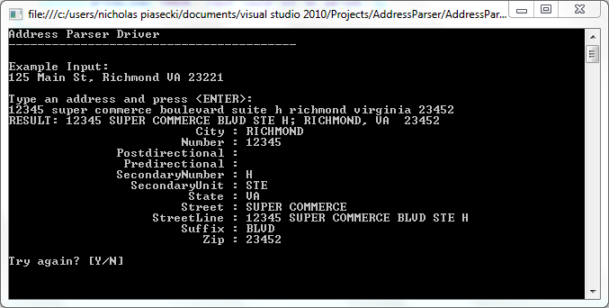


usaddress
=========

Fork of https://usaddress.codeplex.com/

Since codeplex is closing soon, here is the readme from codeplex:

# Project Description
This is a partial port of the Perl Geo::StreetAddress::US CPAN module to C#. The goal is to take a US address as a single-line string and parse it out into its component pieces to accelerate data entry and import.

The class AddressParser takes a semi-structured address input as a single String and returns it parsed into an AddressParseResult instance. It includes some unit tests and a console application so that you can play around with it:

# Where this came from

This code is a partial port of the Geo::StreetAddress:US Perl module from CPAN written by Schuyler D. Erle. In his case, he wrote it as part of the great geocoder.us service that provides free geocoding for US addresses (with some reasonable rate limiting and restrictions for commercial use).

As such, the original Perl module has the ability to parse intersections "Main St & 1st St, Anytown, VA 12345" and partial addresses. I didn't port this functionality over to C# for reasons explained below.

# What this is for

In my case, I wanted to be able to provide a single textbox on a Web page for users to paste in shipping addresses and be able to parse out the address correctly (in a large percentage of cases, at least) into the individual street / city / state / zip fields for database storage and submission to third-party APIs. Instead of having to tab between four different fields, the user can just paste in the address from Word or another Web page and off they go. (If the address parsing fails, then I pop up an AJAX dialog that shows the individual form fields.) I wanted to be able to do this without having to worry about subscribing to, paying for, and integrating with a third-party CASS-certified address verification API. In other words, it's meant to provide a convenience for users when it comes to data entry, not data validation.

As a result of this difference in intended use (geocoding vs parsing), I neglected to port some functionality of the original Perl module (intersections and partial addresses) and added some additional functionality (recognizing PO boxes and military addresses as well as correcting secondary unit abbreviations).

The class could also be useful if you have a large list of unstructured address input and you want some help in getting everything merged into a "mostly correct" set of delimited fields without actually paying for a CASS-certified service.

# What this is NOT for

This does not provide CASS-certified address correction, and it does not verify a delivery point. It does not tell if you an address is correct and/or deliverable. The USPS address database costs real money and is updated monthly, and this doesn't depend on that. 

As such, you can pass in "321 Cheese Street Apt A Sillytown Virginia 12345", and it will happily spit back "321 CHEESE ST APT A; SILLYTOWN VA 12345". It does not know whether or not an address exists.

As such, it cannot provide perfect parse results in all cases, although an effort has been made to cover common ones, such as grid-style addresses, Queens-style addresses, post office boxes, and military addresses. But without a list of valid delivery points, it won't be able to decide if "403D S St" should be "403 SOUTH ST APT D" or "403 D S ST". This is also particularly common when users add nonsense to the street line.

# How it works

Like the original Perl version, the AddressParser class solves the problem by building up a fantastically giant regular expression ("now we have two problems") based on the common abbreviations and formats that a US address can be in. Calling ParseAddress() simply runs a match against that regex and returns any of its named captures as properties in an AddressParseResult instance.

It is certainly not magic. Without a list of valid delivery points, it's impossible for it to know the true intent in some cases, especially if you hand it addresses where users have typed crap in the street line. ("123 Main St Door Code # 438" would result in it thinking the street is named "MAIN DOOR CODE", for example, and without a list of valid streets, it's not going to know that "DOOR CODE" should be part of a leftovers field instead of the street name.)

**Make sure that you can accept these limitations in your intended use case.** I have posted it because I feel that it's something that people could still use in a great many products, and that porting it to C# makes it a bit more accessible to many more people.

> Last edited Dec 24, 2011 at 1:26 PM by npiaseck, version 12

Available on NuGet
==================
[Install-Package AddressParser](http://www.nuget.org/packages/AddressParser/)

Icon
====

[Map](http://thenounproject.com/term/map-marker/30544/) by [Pieter J. Smits](http://thenounproject.com/pjsmits/) from [The Noun Project](http://thenounproject.com/)
